# Project: Secure IAM User Setup with EC2 CLI Access and MFA

## 📘 Overview

This project covers a complete secure IAM user setup, including:
- Creating an IAM user with EC2 full access.
- Enforcing MFA (Multi-Factor Authentication).
- Setting up CLI access using access keys.
- Configuring AWS CLI and launching EC2 instances through it.

---

## 🧰 AWS Services Used

- AWS IAM
- Amazon EC2
- AWS CLI
- MFA Authentication

---

## 🧑‍💻 Project Steps with Screenshots

### 👤 1. Another IAM User Creation  
A new IAM user was created to perform EC2-related operations.  
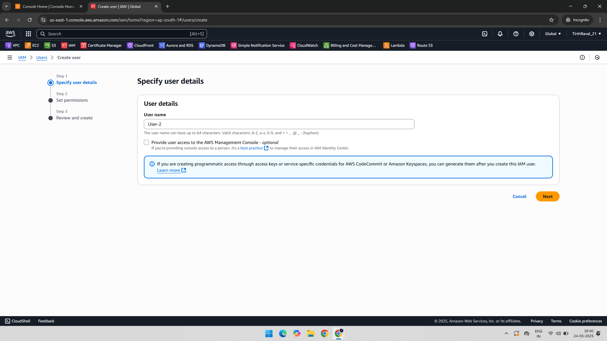

---

### 🔐 2. EC2FullAccess Policy Attached to New User  
The **AmazonEC2FullAccess** policy was assigned to the newly created IAM user.  
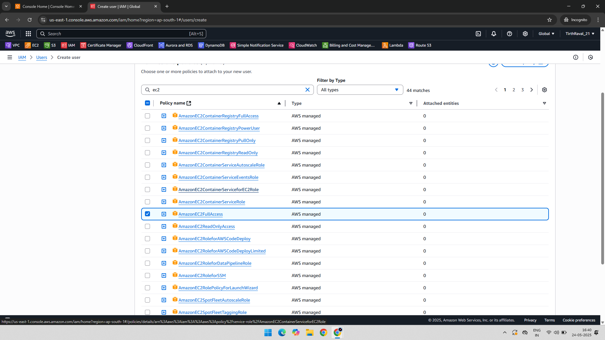

---

### 🔑 3. Console Password Assigned to IAM User  
The user was granted password-based access to the AWS Management Console.  
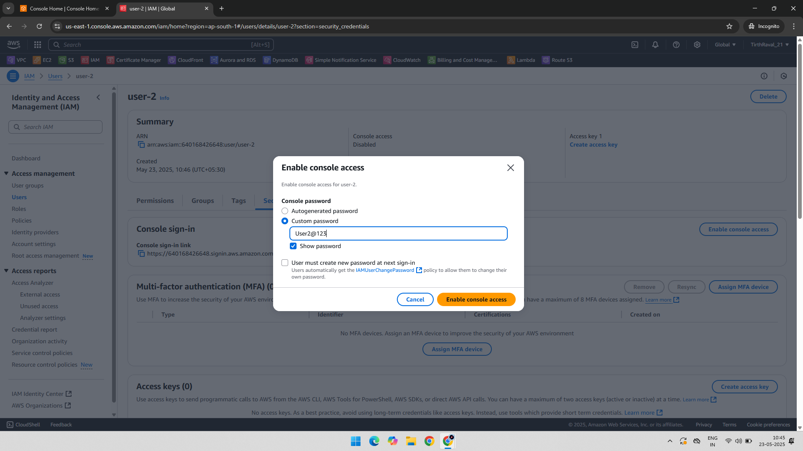

---

### 🔒 4. MFA Device Creation  
Multi-Factor Authentication was enabled to enhance account security.  
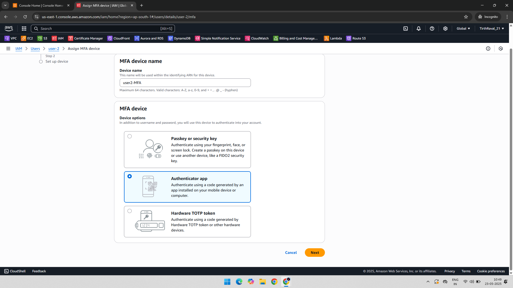

---

### 📱 5. Scan Authenticator App  
The MFA QR code was scanned using an authenticator app (e.g., Google Authenticator).  
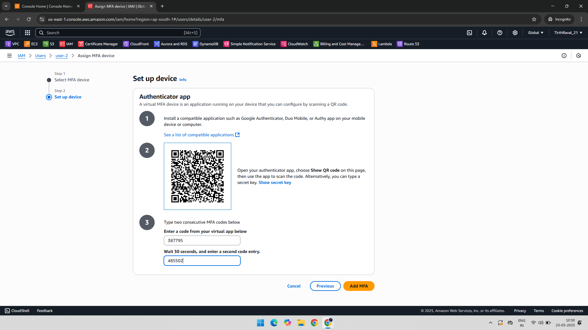

---

### 🗝️ 6. Access Key Creation for CLI Access  
Programmatic access was enabled by generating an Access Key and Secret Key.  
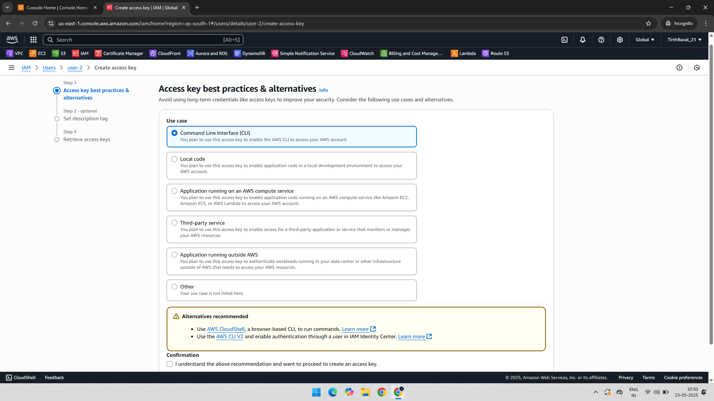

---

### 🧾 7. Access Key Saved  
Keys were saved for AWS CLI configuration.  
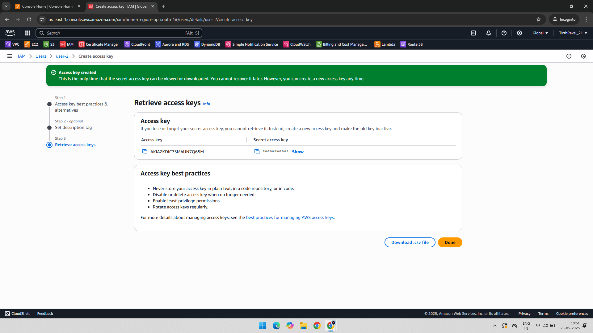

---

### ⚙️ 8. AWS CLI Configuration  
The IAM user was configured using `aws configure`.  
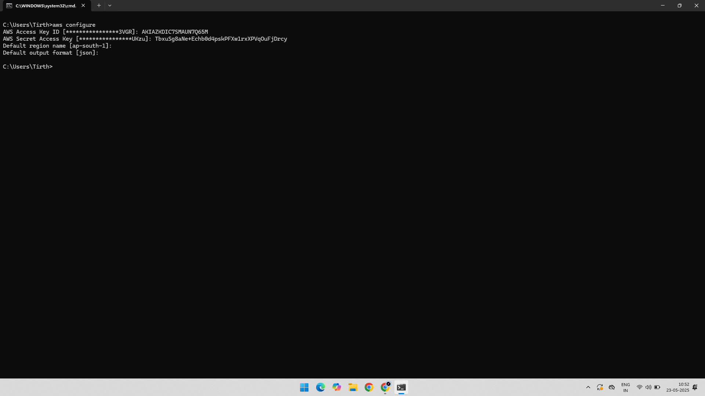

---

### 🔐 9. Sign-In with MFA  
The IAM user logged into the AWS Console with MFA.  
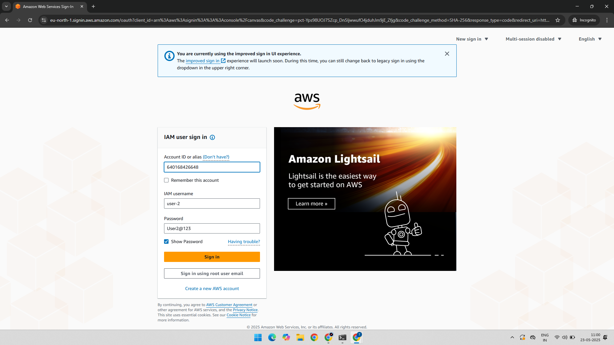

---

### 🔢 10. MFA Code Entry  
The user provided the MFA code from the authenticator app.  
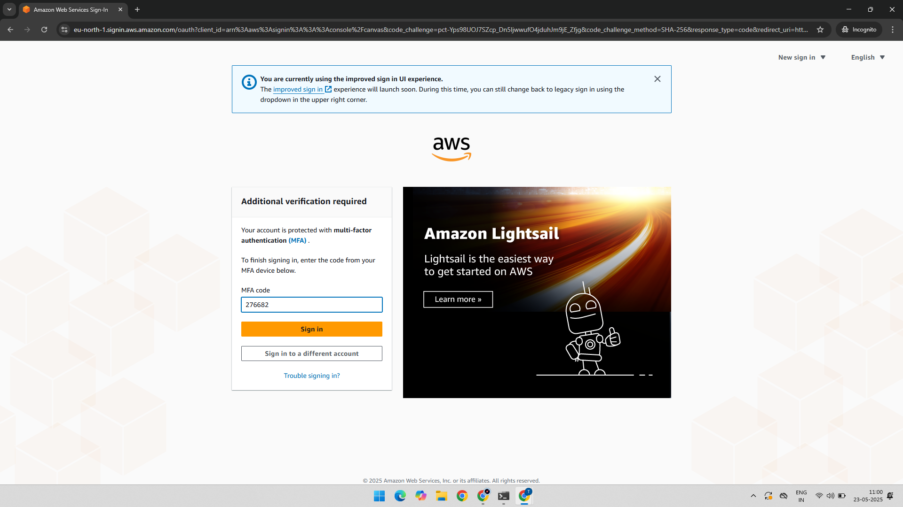

---

### 💻 11. EC2 Instance Launched via AWS Console  
The IAM user launched an EC2 instance from the AWS Console.  
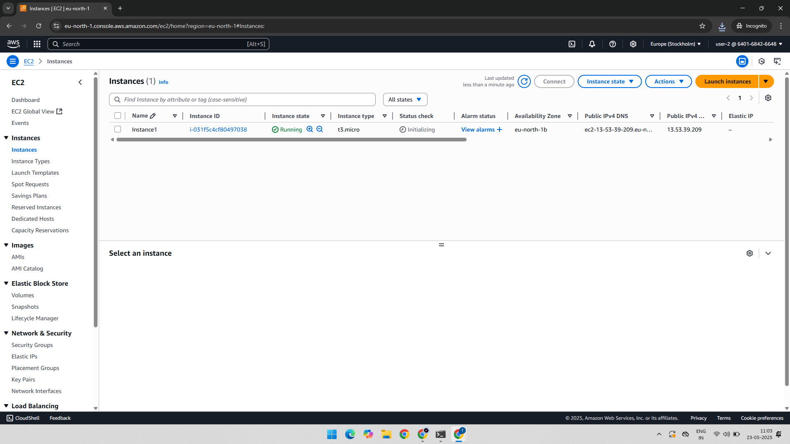

---

### 🧑‍💻 12. EC2 Instance Launched via AWS CLI  
The user created an EC2 instance using a command-line instruction.  

---

### 💼 13. EC2 Instance Created by CLI IAM User  
The CLI-created EC2 instance confirmed successful IAM setup.  
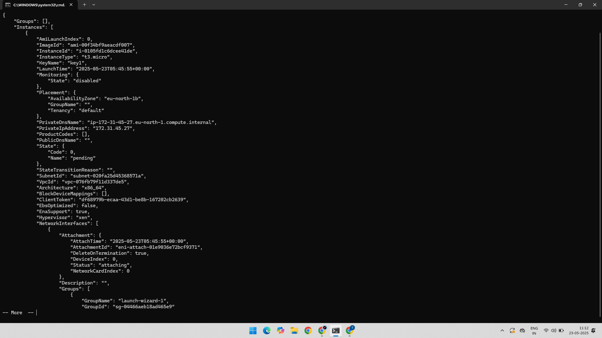

---

### 🧾 14. EC2 Instance Verified from Console  
Final verification of the EC2 instance created using CLI from the AWS Console.  

---

## ✅ Key Learnings

- IAM security best practices (MFA, least privilege).
- AWS CLI configuration and EC2 management.
- Secure automation and access control.
- Dual-level access setup (Console + CLI).

---

## 📁 Folder Structure

IAM-CLI-MFA-AccessKey-Project/  
├── README.md  
├── 01-Another-User-Creation.png  
├── 02-EC2FullAccess-Permission-Another-User.png  
├── 03-Console-Password-to-User.png  
├── 04-MFA-Creation.png  
├── 05-Scan-Authenticator-App.png  
├── 06-Access-Key-Creation-CLI.png  
├── 07-Access-Key-Created.png  
├── 08-AWS-Configure-CLI.png  
├── 09-Sign-In-IAM-User.png  
├── 10-MFA-Code.png  
├── 11-Instance-Created-IAM-User.png  
├── 12-Instance-Creation-Command-CLI.png  
├── 13-Instance-Created-CLI-IAM-User.png  
└── 14-Instance-Created-CLI-Verified-AWS.png
