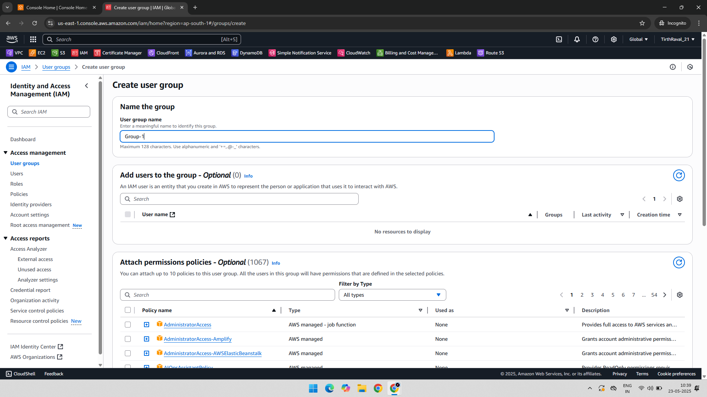
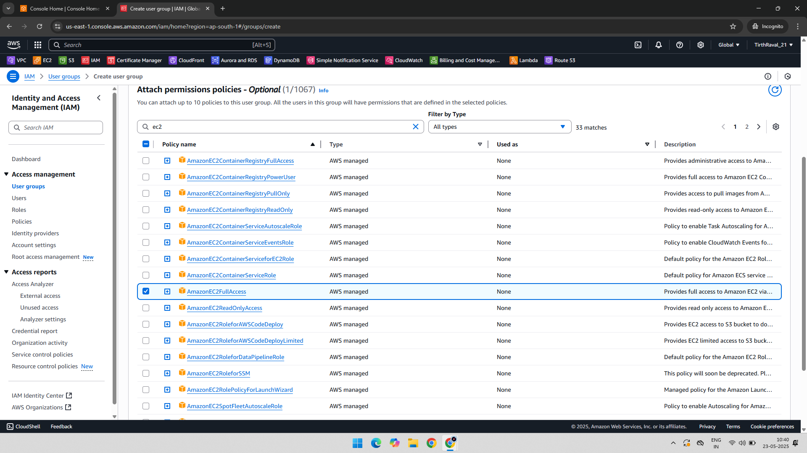
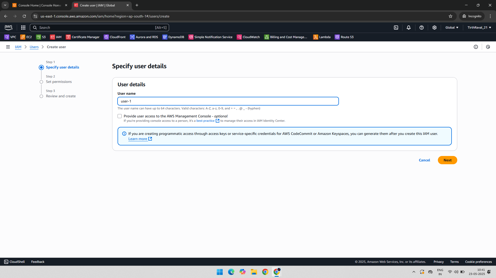
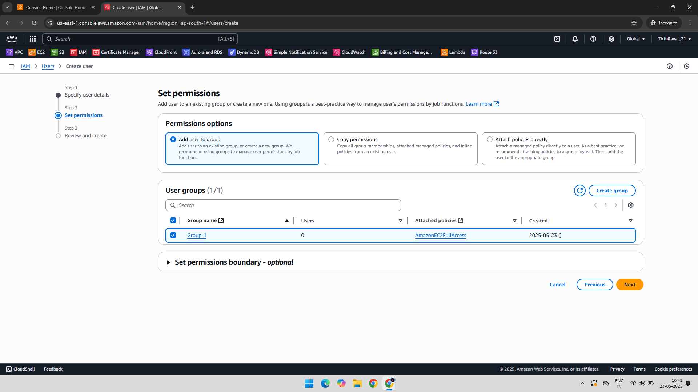

# Project: IAM – Group and User Creation, User Add in Group, Attach Permission (EC2FullAccess)

## 📘 Overview

This IAM practical demonstrates how to:
1. Create an IAM group.
2. Attach EC2 Full Access permissions to the group.
3. Create a new IAM user.
4. Add the user to the permission-enabled group.

---

## 🧰 AWS Services Used

- AWS IAM (Identity and Access Management)

---

## 🧑‍💻 Project Steps with Screenshots

### 👥 1. Group Creation  
An IAM group was created to manage permissions for multiple users collectively.  

---

### 🔐 2. Attach EC2FullAccess Policy to Group  
The **AmazonEC2FullAccess** policy was attached to the newly created group to grant full access to EC2 resources.  

---

### 👤 3. User Creation  
A new IAM user was created to be assigned to the permission-enabled group.  

---

### 👥 4. Add User to Group  
The newly created user was added to the IAM group, inheriting the permissions attached to the group.  

---

## ✅ Benefits of This Approach

- **Role-Based Access Control (RBAC)**: Manage permissions at the group level instead of user-by-user.
- **Simplified User Management**: Easy to onboard or offboard users by managing group membership.
- **Security**: Ensures consistent and auditable permission management.

---

## 📁 Folder Structure

IAM-GroupCreation-UserAddinGroup-AttachPermission/  
├── README.md  
├── 01-Group-Creation.png  
├── 02-Attach-Permission-Group-EC2FullAccess.png  
├── 03-User-Creation.png  
└── 04-User-Added-to-Group.png
