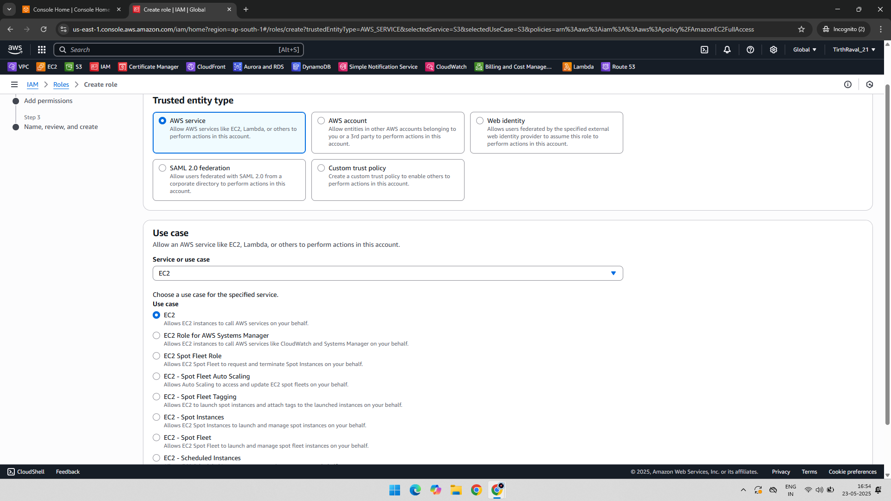
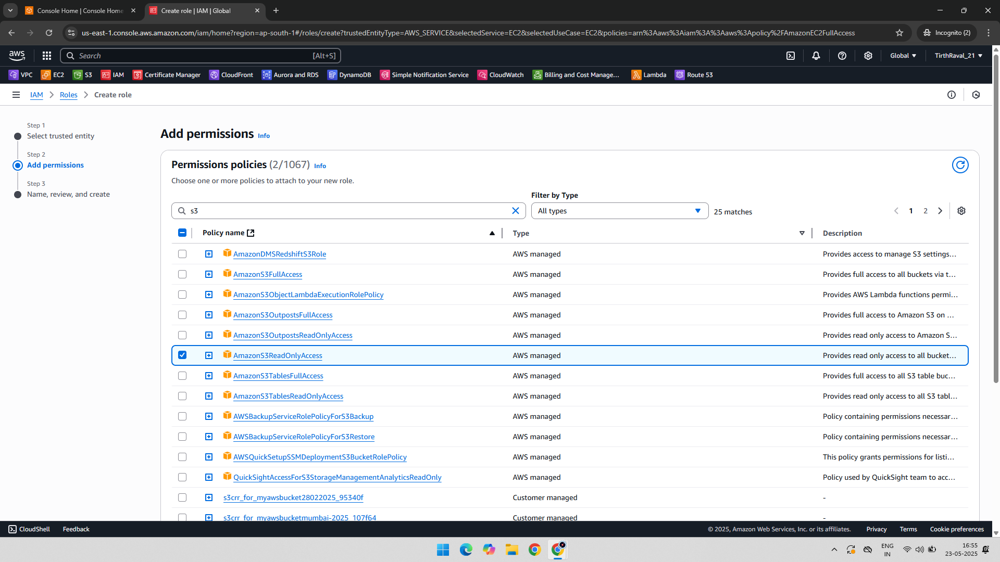
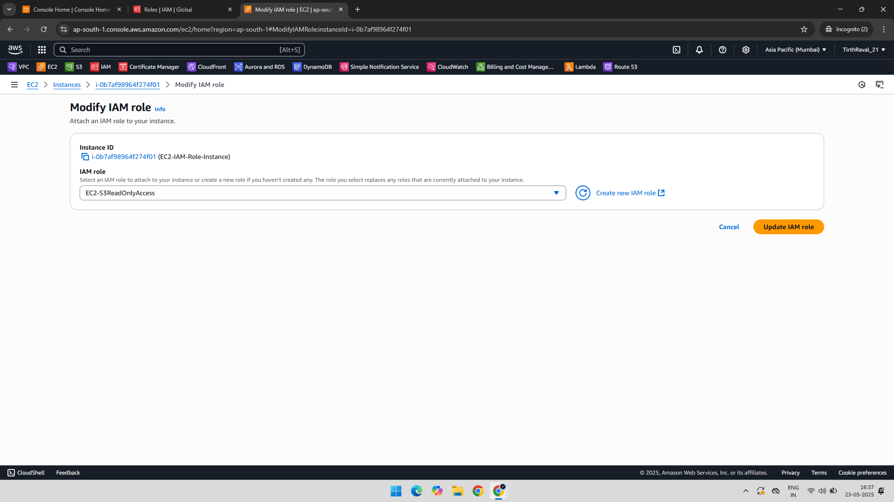
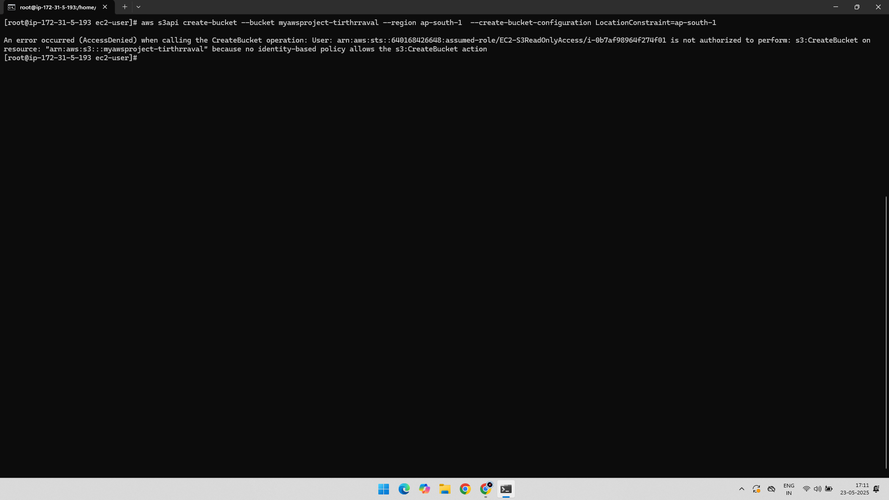

# Project: Assign IAM Role to EC2 for Secure S3 Access

## 📘 Overview

This IAM project demonstrates how to securely provide Amazon S3 access to an EC2 instance using an IAM role. Instead of embedding credentials, this approach uses an IAM role with limited permissions attached to the instance.

---

## 🧰 AWS Services Used

- AWS IAM
- Amazon EC2
- Amazon S3

---

## 🎯 Objective

Allow an EC2 instance to **list S3 buckets** but **deny creation of new buckets** using an IAM role with the `AmazonS3ReadOnlyAccess` policy.

---

## 🧑‍💻 Project Steps with Screenshots

### 1️⃣ Role Creation for EC2  
Created a new IAM Role with the trusted entity set to EC2.  

---

### 2️⃣ Attached AmazonS3ReadOnlyAccess Policy  
Attached the built-in `AmazonS3ReadOnlyAccess` permission to the role.  

---

### 3️⃣ Role Attached to EC2 Instance  
The newly created IAM role was attached to the running EC2 instance.  

---

### 4️⃣ Tested S3 List Operation (Allowed ✅)  
From the EC2 instance, the user ran `aws s3 ls`, successfully listing S3 buckets.  

---

### 5️⃣ Tested S3 Bucket Creation (Denied ❌)  
The command `aws s3 mb s3://bucket-name` was blocked as expected due to read-only permissions.  

---

## ✅ Key Learnings

- Best practices of assigning IAM roles over embedding credentials.
- Granular permission management using AWS managed policies.
- Verification of permissions by testing allowed and denied actions from EC2.
- Real-world implementation of secure resource access.

---

## 📁 Folder Structure

IAM-Role-EC2-S3-Access/  
├── README.md  
├── 01-Role-Creation-For-EC2.png  
├── 02-Added-Permission-AmazonS3ReadOnlyAccess.png  
├── 03-Adding-Created-IAM-Role-to-Instance.png  
├── 04-List-Bucket-YES.png  
└── 05-Create-Bucket-NO.png
