# Project: Create and Attach Custom S3 IAM Policy with CLI Validation

## 📘 Overview

This project focuses on creating a **custom IAM policy** for Amazon S3, attaching it to both an IAM role and a user, and validating its functionality using AWS CLI. It demonstrates fine-grained permission control and hands-on access testing.

---

## 🧰 AWS Services Used

- AWS IAM (Users, Roles, Policies)
- Amazon S3
- AWS CLI
- AWS Console

---

## 🎯 Objective

1. Create a **custom IAM policy** allowing specific S3 actions.
2. Attach the policy to a **role** and a **user**.
3. Validate allowed and denied actions through CLI and Console.

---

## 🧑‍💻 Project Steps with Screenshots

### 1️⃣ Custom Policy Creation for S3  
A new policy was created with actions like `s3:PutObject`, `s3:GetObject`, `s3:DeleteObject`, etc.  
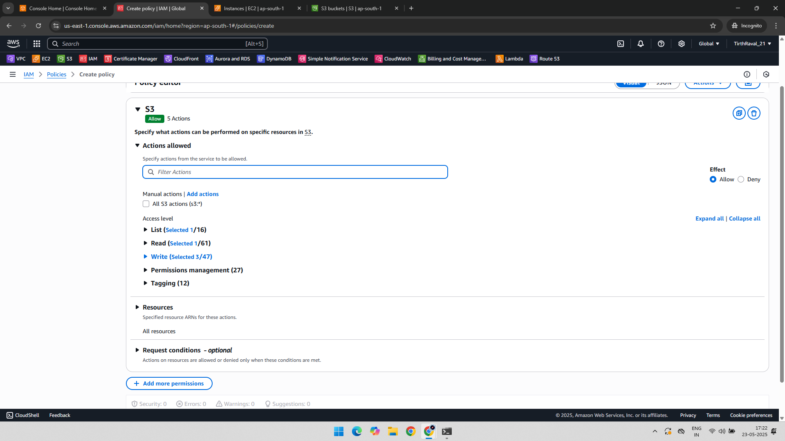

---

### 2️⃣ Actions Defined in the Policy  
Only specific S3 actions were allowed in the policy.  
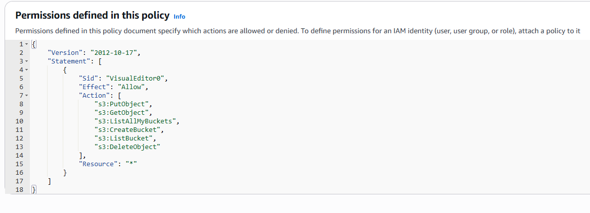

---

### 3️⃣ Policy Attached to IAM Role  
The custom policy was attached to an IAM role.  
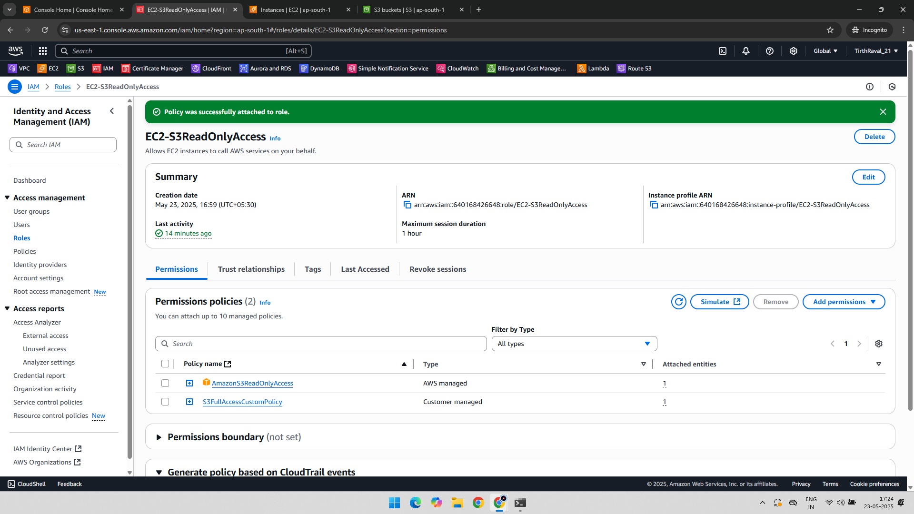

---

### 4️⃣ Policy Also Attached to a User  
The same policy was added to a user for CLI testing.  
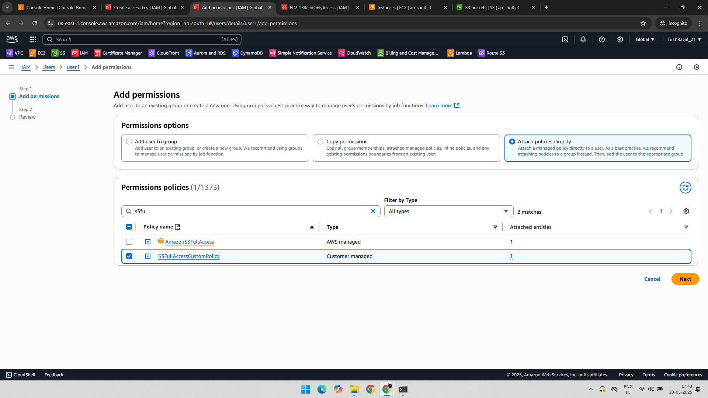

---

### 5️⃣ Created Bucket via CLI  
Created a new S3 bucket from the CLI.  
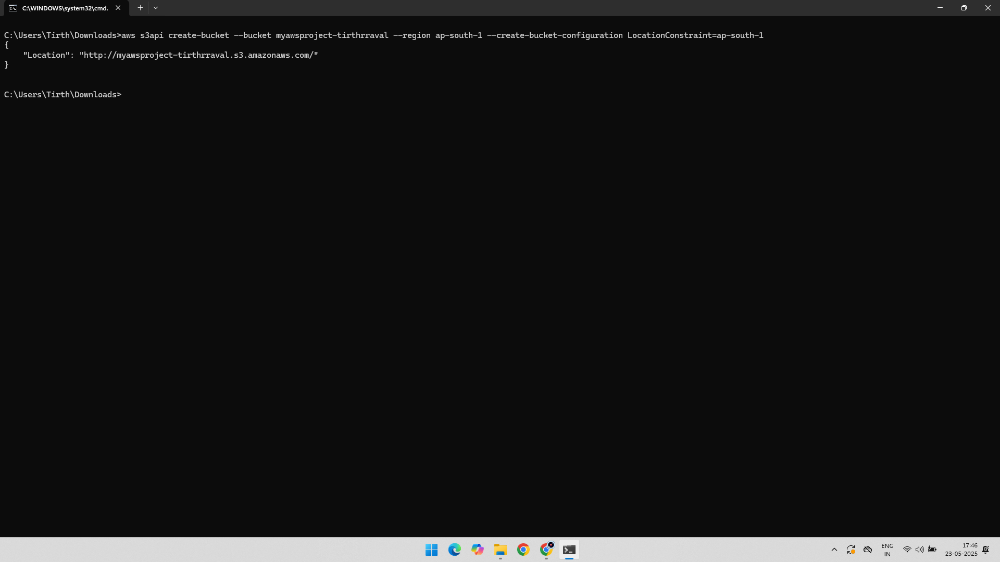

---

### 6️⃣ Verified Bucket on Console  
Checked if the bucket was successfully created via AWS Console.  
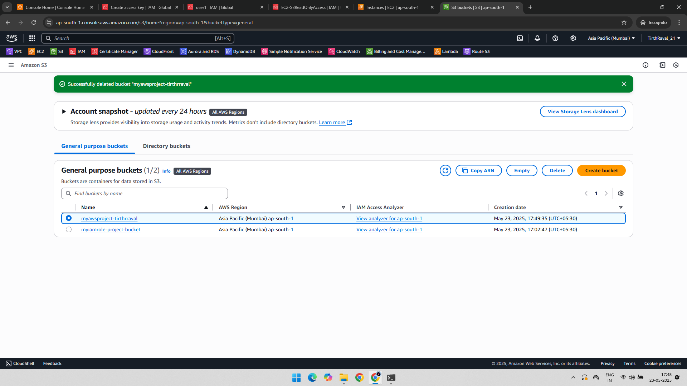

---

### 7️⃣ Uploaded Object via CLI  
Uploaded a test file to the bucket using AWS CLI.  
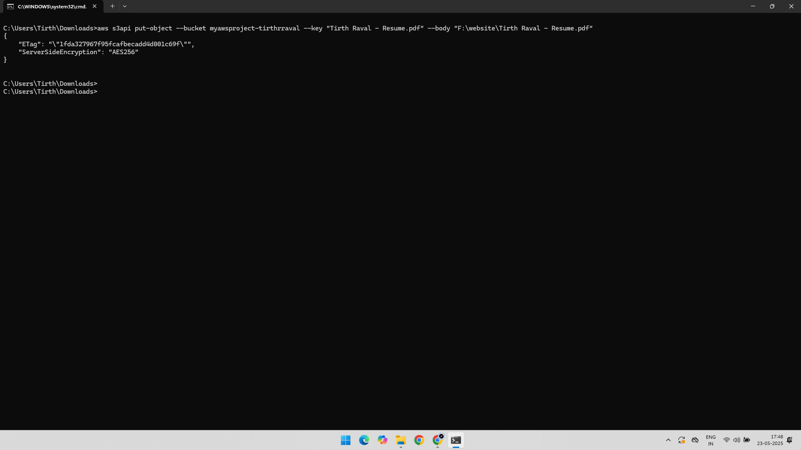

---

### 8️⃣ Verified Upload on Console  
Confirmed the uploaded object appears in the S3 console.  
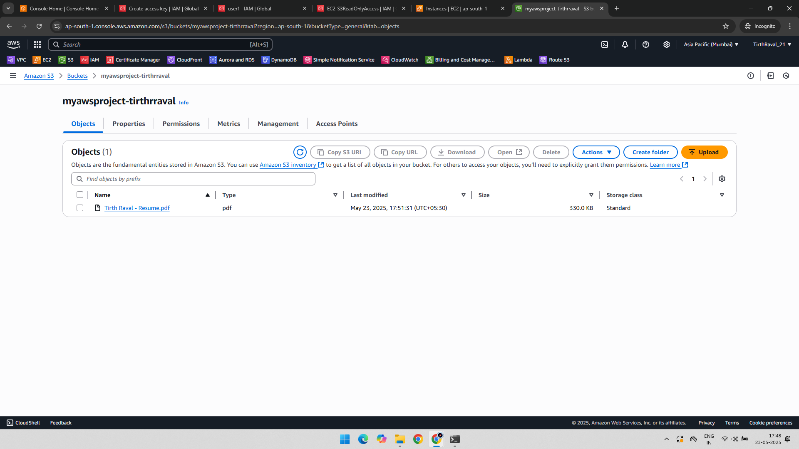

---

### 9️⃣ Downloaded Object via CLI  
Downloaded the file from the bucket using AWS CLI. 
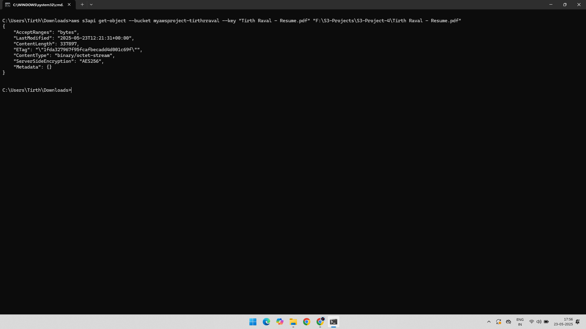

---

### 🔟 Confirmed File Download  
Verified that the object was successfully downloaded.  
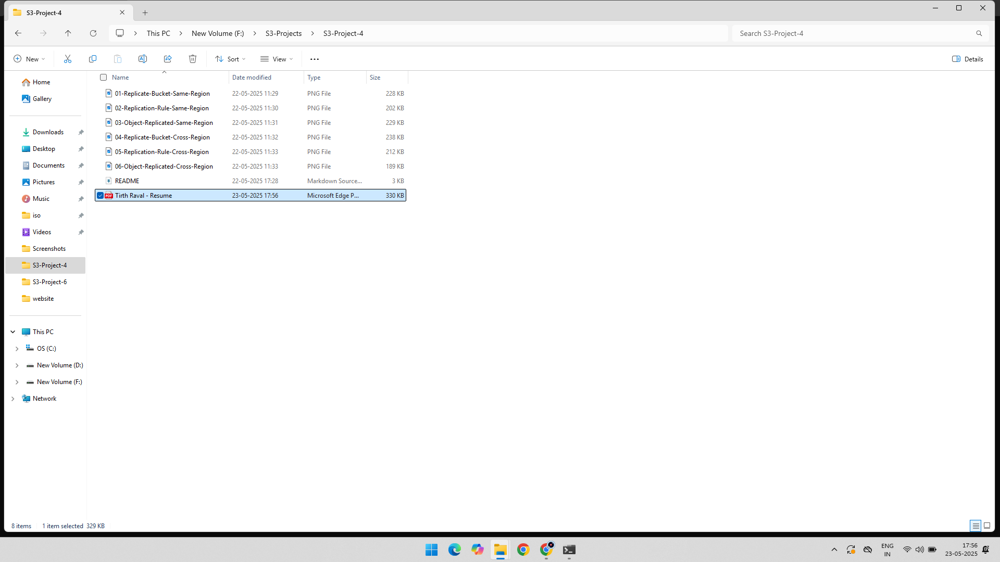

---

### 1️⃣1️⃣ Listed Buckets and Objects  
Listed all available S3 buckets and their objects.  
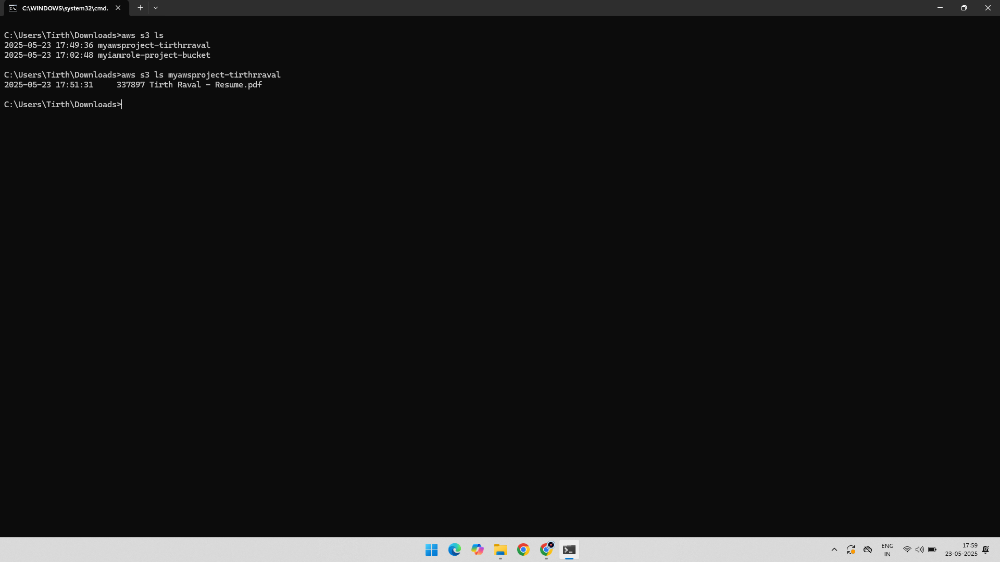

---

### 1️⃣2️⃣ Deleted Object from CLI  
Performed an object deletion operation.  
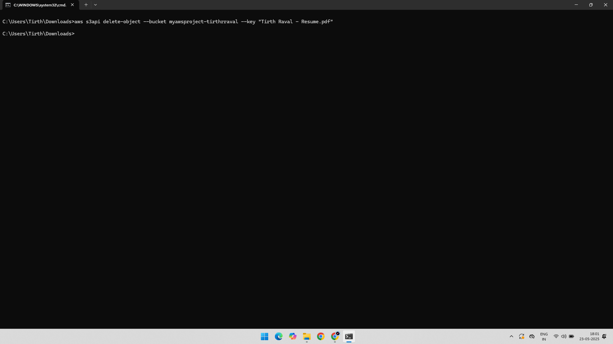

---

### 1️⃣3️⃣ Confirmed Object Deletion via Console  
Verified deletion using the AWS Management Console.  
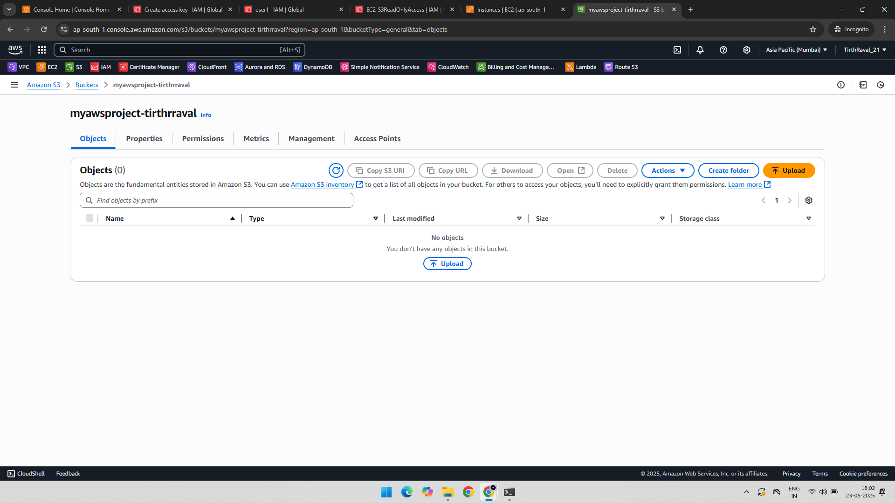

---

## ✅ Key Learnings

- How to design and create a **custom IAM policy**.
- Understand **fine-grained access control** in S3 using IAM.
- How to **assign policies** to both IAM users and roles.
- CLI-based validation of real-world actions for upload, download, and delete operations.
- Importance of least privilege and testing access securely.

---

## 📁 Folder Structure

IAM-S3-Custom-Policy-Project/  
├── README.md  
├── 01-Policy-Creation-S3.png  
├── 02-Actions-Allowed-In-Policy.png  
├── 03-Added-Policy-to-IAM-Role.png  
├── 04-Policy-Attach-to-User.png  
├── 05-Create-Bucket-CLI.png  
├── 06-Check-Bucket-Created-AWS-Console.png  
├── 07-Put-Object-CLI.png  
├── 08-Check-Object-Uploaded-AWS-Console.png  
├── 09-Get-Object-CLI.png  
├── 10-Check-File-Downloaded.png  
├── 11-List-Bucket-and-Object-CLI.png  
├── 12-Delete-Object-CLI.png  
└── 14-Check-Object-Deleted-AWS-Console.png
